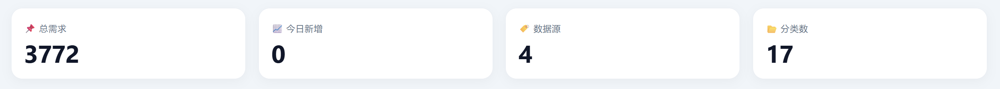
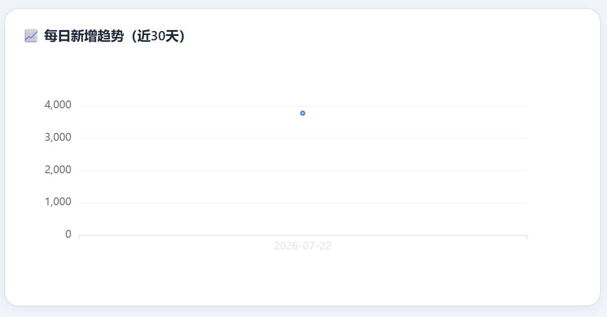
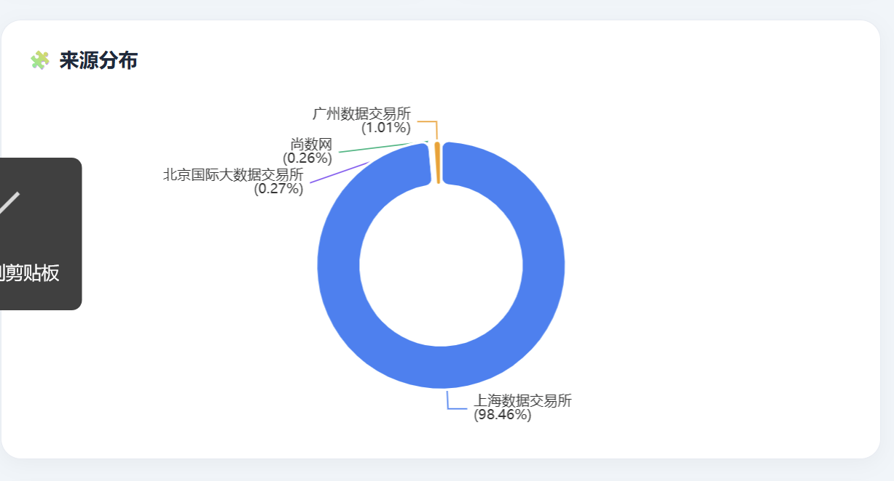
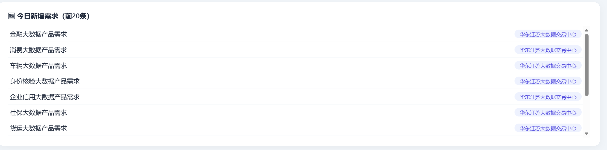

# 📊 数据需求自动采集与可视化系统

> 多源数据需求的每日自动抓取、清洗、存储与可视化展示


---

## 🎯 项目简介

本项目实现了对 **尚数网、北京、上海、广州、杭州、深圳、山东、湖南、郑州、华东江苏、安徽、北部湾、浙江** 等全国主要数据交易平台的数据需求的每日自动抓取、清洗、存储与可视化展示。

系统每天定时运行，自动产出干净的增量数据，并通过交互式看板直观展示需求趋势与来源分布。

---

## ✨ 功能特性

- **自动抓取**：工作日 10:00 定时运行，支持 **13 个数据源**
- **数据清洗**：自动去重、字段修复、HTML 标签清理、分类映射
- **数据存储**：SQLite 数据库 + CSV 导出（全量 / 拆分 / 增量）
- **可视化看板**：Flask + ECharts 实现，支持日期 / 来源筛选、数据导出
- **安全加固**：敏感信息通过环境变量管理，不写入代码
- **日志轮转**：自动切割日志，单文件 5MB，保留 5 个备份
- **异常重试**：网络请求自动重试，提高稳定性
- **深圳公众号解析**：支持从公众号文章自动提取结构化需求，支持多种格式

---

## 🛠️ 技术栈

| 类别 | 技术 |
|------|------|
| 爬虫 | Python · Requests · BeautifulSoup |
| 数据处理 | Pandas · SQLite · 正则表达式 |
| 定时调度 | schedule |
| 可视化 | Flask · ECharts |
| 日志 | RotatingFileHandler |
| 版本控制 | Git · GitHub |

---

## 📊 数据来源

| 序号 | 数据源 | 状态 | 接入方式 | 数据量 |
|------|--------|------|----------|--------|
| 1 | 尚数网 | ✅ 稳定 | 公开 API | ~10 条 |
| 2 | 北京国际大数据交易所 | ✅ 稳定 | API + Cookie | ~10 条 |
| 3 | 上海数据交易所 | ✅ 稳定 | API + Cookie | ~18 条 |
| 4 | 广州数据交易所 | ✅ 稳定 | API + Token | ~39 条 |
| 5 | 杭州数据交易所 | ✅ 稳定 | API + Cookie | ~23 条 |
| 6 | 山东数据交易平台 | ✅ 稳定 | API + Cookie | ~16 条 |
| 7 | 湖南大数据交易所 | ✅ 稳定 | API + Cookie + Token | ~6 条 |
| 8 | 郑州数据交易中心 | ✅ 稳定 | API + Cookie | ~10 条 |
| 9 | 华东江苏大数据交易中心 | ✅ 完全接入 | API + Cookie | ~62 条 |
| 10 | 安徽数据交易所 | ✅ 稳定 | API + Cookie | ~11 条 |
| 11 | 北部湾大数据交易中心 | ✅ 稳定 | HTML 解析 | ~20 条 |
| 12 | 浙江大数据交易服务平台 | ✅ 稳定 | API + Cookie + Token | ~7 条 |
| 13 | 深圳数据交易所 | ✅ 已接入 | 公众号解析 | 动态更新 |

> **深圳数据交易所**：通过解析官方公众号的“数据需求发布”文章提取需求数据，支持 `01/02`、`采购需求1/2`、`需求一/二` 等多种格式。需定期在 `config.yaml` 中手动添加新文章链接，解析后自动去重入库。

---

## 📊 看板预览

### 总览卡片



### 每日新增趋势



### 来源分布



### 今日新增需求列表



> 注：截图当日无新增需求，不代表系统异常。

---

## 🚀 快速运行

### 1. 克隆项目

```bash
git clone https://github.com/2433931816/data-demand-crawler.git
cd data-demand-crawler